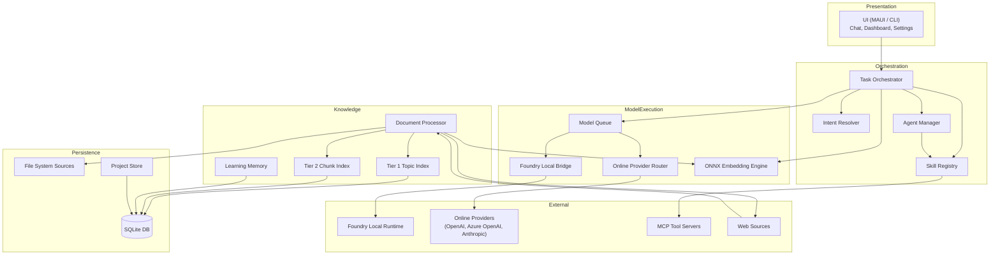

# Architecture Overview

```mermaid
flowchart TB
    subgraph Presentation
        UI["UI (MAUI / CLI)\nChat, Dashboard, Settings"]
    end

    subgraph Orchestration
        Orchestrator["Task Orchestrator"]
        Intent["Intent Resolver"]
        Agents["Agent Manager"]
        Skills["Skill Registry"]
    end

    subgraph ModelExecution
        Queue["Model Queue"]
        Foundry["Foundry Local Bridge"]
        OnlineRouter["Online Provider Router"]
        Embedding["ONNX Embedding Engine"]
    end

    subgraph Knowledge
        DocProc["Document Processor"]
        Tier1["Tier 1 Topic Index"]
        Tier2["Tier 2 Chunk Index"]
        Learnings["Learning Memory"]
    end

    subgraph Persistence
        Sqlite[("SQLite DB")]
        Files["File System Sources"]
        ProjectStore["Project Store"]
    end

    subgraph External
        FoundryRuntime["Foundry Local Runtime"]
        OnlineProviders["Online Providers\n(OpenAI, Azure OpenAI, Anthropic)"]
        Mcp["MCP Tool Servers"]
        WebSources["Web Sources"]
    end

    UI --> Orchestrator
    Orchestrator --> Intent
    Orchestrator --> Agents
    Orchestrator --> Skills
    Agents --> Skills

    Orchestrator --> Queue
    Queue --> Foundry
    Queue --> OnlineRouter
    Foundry --> FoundryRuntime
    OnlineRouter --> OnlineProviders

    Orchestrator --> Embedding
    DocProc --> Embedding

    DocProc --> Tier1
    DocProc --> Tier2
    Tier1 --> Sqlite
    Tier2 --> Sqlite
    Learnings --> Sqlite

    DocProc --> Files
    ProjectStore --> Sqlite

    Skills --> Mcp
    DocProc --> WebSources
    WebSources --> DocProc
```
