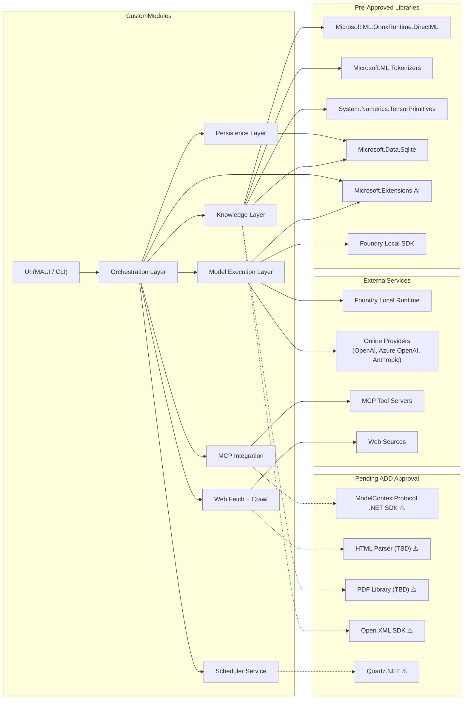

# Module And Library Map

## Dependency Philosophy

**External dependencies are minimized by default.** Libraries shown below are either:
- Part of .NET framework (System.*, Microsoft.Extensions.*)
- Microsoft-supported (ONNX Runtime, ML.NET, Azure SDKs)
- Explicitly approved via Architecture Decision Document (ADD)

**All other dependencies require ADD approval.** See `./decisions/` directory for approved decisions.

**Legend:**
- Solid lines → Approved dependencies
- Dashed lines → Require Architecture Decision Document (ADD)
- ⚠️ → Not yet approved, ADD required before implementation
