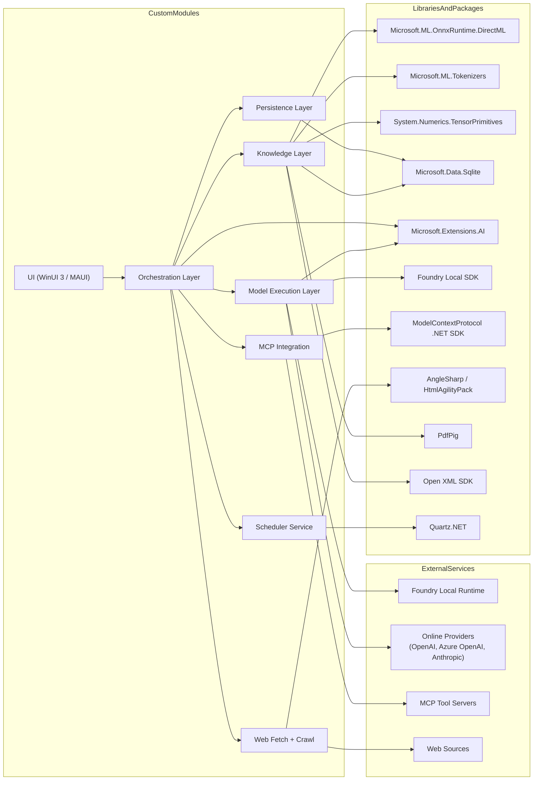

# Module And Library Map

```mermaid
flowchart LR
    subgraph CustomModules
        UI["UI (WinUI 3 / MAUI)"]
        Orchestration["Orchestration Layer"]
        ModelExec["Model Execution Layer"]
        Knowledge["Knowledge Layer"]
        Scheduler["Scheduler Service"]
        WebFetch["Web Fetch + Crawl"]
        McpIntegration["MCP Integration"]
        Persistence["Persistence Layer"]
    end

    subgraph LibrariesAndPackages
        Onnx["Microsoft.ML.OnnxRuntime.DirectML"]
        Tokenizers["Microsoft.ML.Tokenizers"]
        Tensor["System.Numerics.TensorPrimitives"]
        SqliteLib["Microsoft.Data.Sqlite"]
        ExtAI["Microsoft.Extensions.AI"]
        FoundrySdk["Foundry Local SDK"]
        McpSdk["ModelContextProtocol .NET SDK"]
        HtmlParser["AngleSharp / HtmlAgilityPack"]
        PdfLib["PdfPig"]
        OpenXml["Open XML SDK"]
        Quartz["Quartz.NET"]
    end

    subgraph ExternalServices
        FoundryRuntime["Foundry Local Runtime"]
        OnlineProviders["Online Providers\n(OpenAI, Azure OpenAI, Anthropic)"]
        McpServers["MCP Tool Servers"]
        WebSources["Web Sources"]
    end

    ModelExec --> ExtAI
    ModelExec --> FoundrySdk
    ModelExec --> FoundryRuntime
    ModelExec --> OnlineProviders

    Knowledge --> Onnx
    Knowledge --> Tokenizers
    Knowledge --> Tensor
    Knowledge --> SqliteLib

    WebFetch --> HtmlParser
    WebFetch --> WebSources

    Orchestration --> ExtAI
    McpIntegration --> McpSdk
    McpIntegration --> McpServers

    Scheduler --> Quartz
    Persistence --> SqliteLib

    Knowledge --> PdfLib
    Knowledge --> OpenXml

    UI --> Orchestration
    Orchestration --> ModelExec
    Orchestration --> Knowledge
    Orchestration --> Scheduler
    Orchestration --> WebFetch
    Orchestration --> McpIntegration
    Orchestration --> Persistence
```
