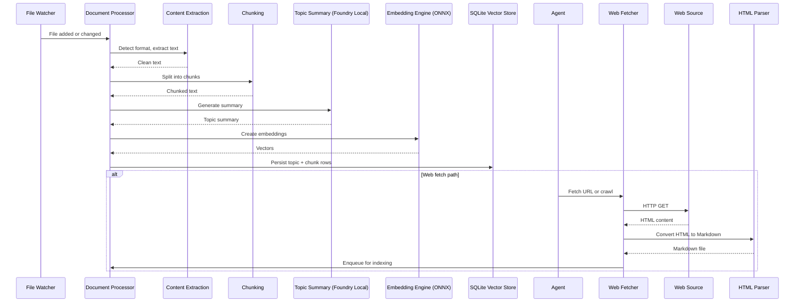

# Sequence - Document Ingestion And Web Fetch

```mermaid
sequenceDiagram
    participant Watcher as File Watcher
    participant DocProc as Document Processor
    participant Extract as Content Extraction
    participant Chunk as Chunking
    participant Summarize as Topic Summary (Foundry Local)
    participant Embed as Embedding Engine (ONNX)
    participant Store as SQLite Vector Store

    Watcher->>DocProc: File added or changed
    DocProc->>Extract: Detect format, extract text
    Extract-->>DocProc: Clean text
    DocProc->>Chunk: Split into chunks
    Chunk-->>DocProc: Chunked text
    DocProc->>Summarize: Generate summary
    Summarize-->>DocProc: Topic summary
    DocProc->>Embed: Create embeddings
    Embed-->>DocProc: Vectors
    DocProc->>Store: Persist topic + chunk rows

    alt Web fetch path
        participant Agent as Agent
        participant WebFetch as Web Fetcher
        participant Web as Web Source
        participant Html as HTML Parser
        Agent->>WebFetch: Fetch URL or crawl
        WebFetch->>Web: HTTP GET
        Web-->>WebFetch: HTML content
        WebFetch->>Html: Convert HTML to Markdown
        Html-->>WebFetch: Markdown file
        WebFetch->>DocProc: Enqueue for indexing
    end
```
