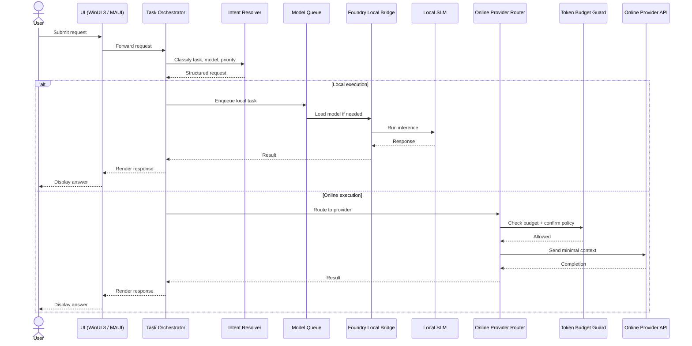

# Sequence - User Request Handling

```mermaid
sequenceDiagram
    actor User
    participant UI as UI (WinUI 3 / MAUI)
    participant Orchestrator as Task Orchestrator
    participant Intent as Intent Resolver
    participant Queue as Model Queue
    participant Foundry as Foundry Local Bridge
    participant LocalModel as Local SLM
    participant Router as Online Provider Router
    participant Budget as Token Budget Guard
    participant Provider as Online Provider API

    User->>UI: Submit request
    UI->>Orchestrator: Forward request
    Orchestrator->>Intent: Classify task, model, priority
    Intent-->>Orchestrator: Structured request

    alt Local execution
        Orchestrator->>Queue: Enqueue local task
        Queue->>Foundry: Load model if needed
        Foundry->>LocalModel: Run inference
        LocalModel-->>Foundry: Response
        Foundry-->>Orchestrator: Result
        Orchestrator-->>UI: Render response
        UI-->>User: Display answer
    else Online execution
        Orchestrator->>Router: Route to provider
        Router->>Budget: Check budget + confirm policy
        Budget-->>Router: Allowed
        Router->>Provider: Send minimal context
        Provider-->>Router: Completion
        Router-->>Orchestrator: Result
        Orchestrator-->>UI: Render response
        UI-->>User: Display answer
    end
```
